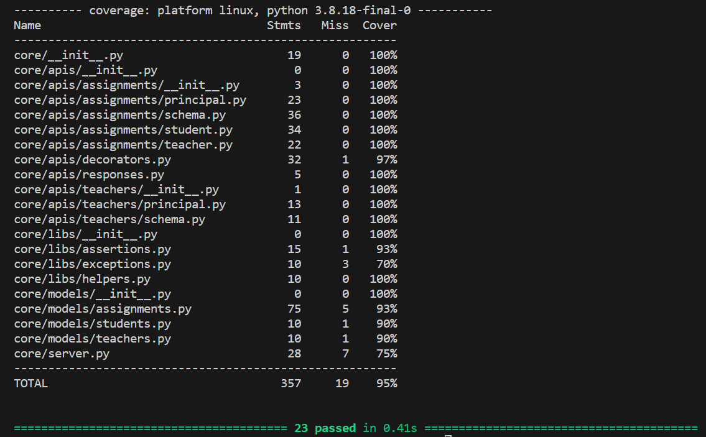
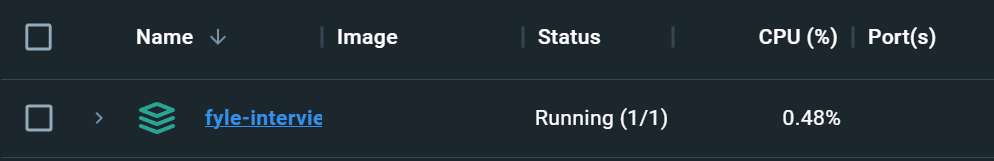

# Fyle Backend Challenge
<!-- Image center -->
<p align="center">
  
</p>


Hello everyone at Fyle, 

I really love the the new format of the assignment, the requirements were clearly stated, even though I had little to no prior experience with Flask, as I had worked extensively with Django and FastAPI, the repo was easy to work on.

- [x] Added Missing Missing APIs - [Postman Documentation](https://documenter.getpostman.com/view/21779136/2s9YsNdqVj)


- [x] Automated Tests are Working 
- [x] Improved the Test Coverage to 95% and added some additional tests for grading API


- [x] Dockerised the Application with Dockerfile and docker-compose.yml

Here are the following things I noticed about repo and could be improved:

### Problem 1
Problem: There is no check in the header to check if the id for principal, teacher or student exists in the database or not.

Solution: Query the database whether it exists or not

### Problem 2
Problem: Exposing sequential id in the headers is big security threat and can be easily guessed by the user

Solution:
- Apply Rate-Limiting to the APIs
- Keep auto_increment ids as primary key, implement uuid to implement a external_id, this will be used to reference the objects in the APIs

### Problem 3
Problem: No separate test database, tests directly run on production server.

Solution: Create a separate test database, create fake data and delete the database after tests are run.

### Problem 4
Problem: Ids hard encoded in database

Solution: Make use of pytest fixtures or query from database for ids that fullfill a certain condition like get assignments with state "GRADED" and etc.

## Installation

### Run using Docker
To run the docker on local machine simply run the following command:
```
docker-compose up -d
```

### Install requirements

```
virtualenv env --python=python3.8
source env/bin/activate
pip install -r requirements.txt
```
### Reset DB

```
export FLASK_APP=core/server.py
rm core/store.sqlite3
flask db upgrade -d core/migrations/
```
### Start Server

```
bash run.sh
```
### Run Tests

```
pytest -vvv -s tests/

# for test coverage report
# pytest --cov
# open htmlcov/index.html
```


# About Me:
<p align="center">
  
</p>


I am Suyash Singh, a final year student. I am well versed with Python, Django, Redis, Apache Kafka, Celery and Websockets.

A Little bit about me: I have strong problem solving skills and regularly practice on major coding platforms. I have Three Internship Experiences, Open Source Contributions and some notable hackathon wins are KAVACH-2023 Winner, 2x times NIT Jalandhar Hackmol Winner, Smart India Hackathon Winner, Bajaj HackRx 4.0 Runner Up, which showcase my skills as a great backend developer.

My Work: Silive Website: The Software Development Center of the
College. Link: www.silive.in Tech Stack: Python, Django, HTML, CSS

Cryptocurrency Investigation Tool: Kavach Cybersecurity 2023 Hackathon
Winning project. Tech Stack: React, Django, Python
https://github.com/I-polusta/kavach2023

More-Fit: https://github.com/GeekGawd/morefit-ml My machine learning
work done for the winning idea in Smart India Hackathon. Tech Stack:
Android(Kotlin), Django, Tensorflow Lite

Log-Tracer Application: This uses Golang, Grafana and InfluxDB. This
is a personal project to store the api status and timestamps and error
which can be easily visualised in the grafana dashboard.
https://github.com/GeekGawd/logtracer

Cryptocurrency Tracking Application:
https://github.com/GeekGawd/cryptocurrency-tracker-application This
project sets alerts to the cryptocurrency and sends it using email. I
used cron jobs, websockets and kafka to make this system.

I have also contributed to Wagtail and other open source
repositiories, which can be found on my github:
https://github.com/GeekGawd

Resume:
https://drive.google.com/file/d/1w2Su8hzLM5_9KVm14GvLbt9sVpNjYNBt/view?usp=sharing